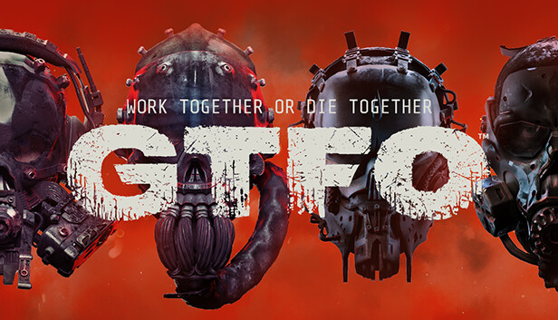

  <h1>GTFO</h1>
  <h2>Work Together or Die Together</h2>

<h3>
Genre: First-Person Shooter, Cooperative

Developer: 10 Chambers Collective

Publisher: 10 Chambers Collective

Release Date: December 9, 2019

Gameplay:

GTFO is designed to be a challenging cooperative experience, requiring players to work together to survive in a hostile and atmospheric environment.
The game focuses on teamwork, communication, and strategic planning as players delve into dark and dangerous areas to complete various objectives.
It features both player versus environment (PvE) and player versus enemy (PvE) elements, with a strong emphasis on intense, atmospheric horror.

Setting:

The game is set in a mysterious underground complex where players encounter a variety of hostile creatures.
The environment is procedurally generated, providing a dynamic and unpredictable experience for players.
Characters and Story:

GTFO features a mysterious storyline that unfolds as players progress through the game.
Players take on the roles of "Prisoners," tasked with completing missions given by an entity known as "The Warden."

Weapons and Equipment:

The game offers a variety of weapons and equipment to aid players in their missions.
Players must carefully manage their resources and choose their loadouts strategically.
</h3>

